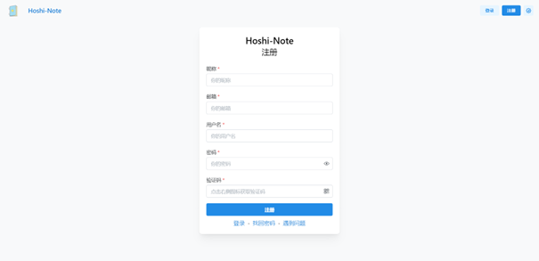
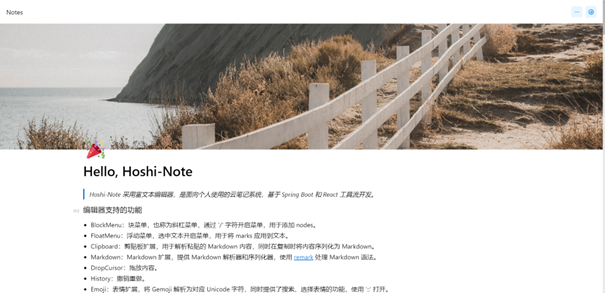
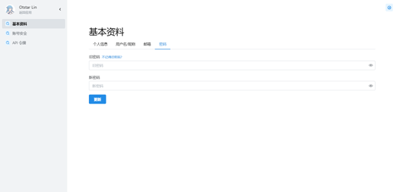

# Hoshi-Note

## Introduction

Hoshi-Note 是一个云笔记系统，由 Hoshi-UI 模块提供前端界面。

基于 Spring Boot 与 Spring Cloud 开发，采用微服务及分布式模式部署，集群使用 Kubernetes 进行管理。

## Features

- 容器化部署，同时采用 Kubernetes 对容器进行编排
- Spring Boot 与 Spring Cloud 开发，并集成 Spring Cloud Kubernetes，为微服务提供原生支持的服务发现与配置管理
- 单点登录支持
- React 编写前端组件，实现前后的分离
- 使用 MinIO、CockroachDB、Redis、RabbitMQ 服务组件，原生支持分布式部署
- Grafana、Prometheus、Loki 作为集群指标与日志收集的监控平台
- 使用 GitHub Actions 与 GitHub Packages 实现持续集成与持续部署

## Installation

```shell
mvn package -DskipTests
java -jar /app/<module>-1.0-SNAPSHOT.jar
```

## Function and Architecture


## Render











## Maintainer

hoshi-note 由 [Otstar Lin](https://ixk.me/)
和下列 [贡献者](https://github.com/syfxlin/hoshi-note/graphs/contributors)
的帮助下撰写和维护。

> Otstar Lin - [Personal Website](https://ixk.me/) · [Blog](https://blog.ixk.me/) · [Github](https://github.com/syfxlin)

## License


根据 Apache License 2.0 许可证开源。
